<div align="center">
    <h1 align="center"><a href="https://github.com/hhftechnology/middleware-manager-traefik">Traefik/Pangolin Middleware Manager</a></h1>
</div>

<h3 align="center">Comprehensive Middleware, Router, and Service Management for Traefik</h3>

<div align="center">
  <h5>
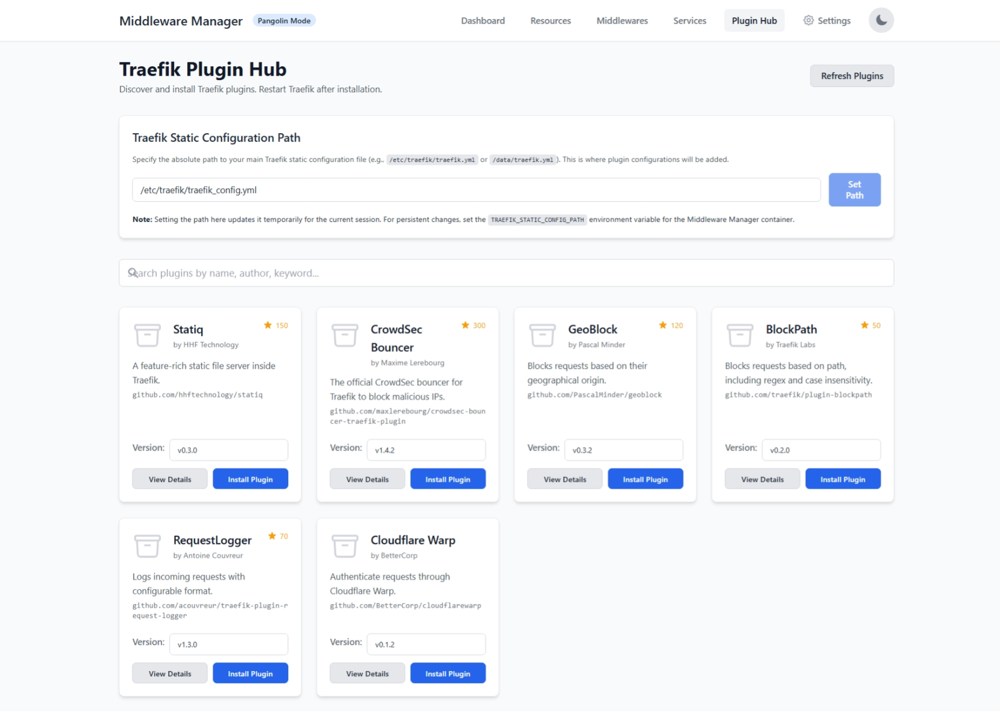  
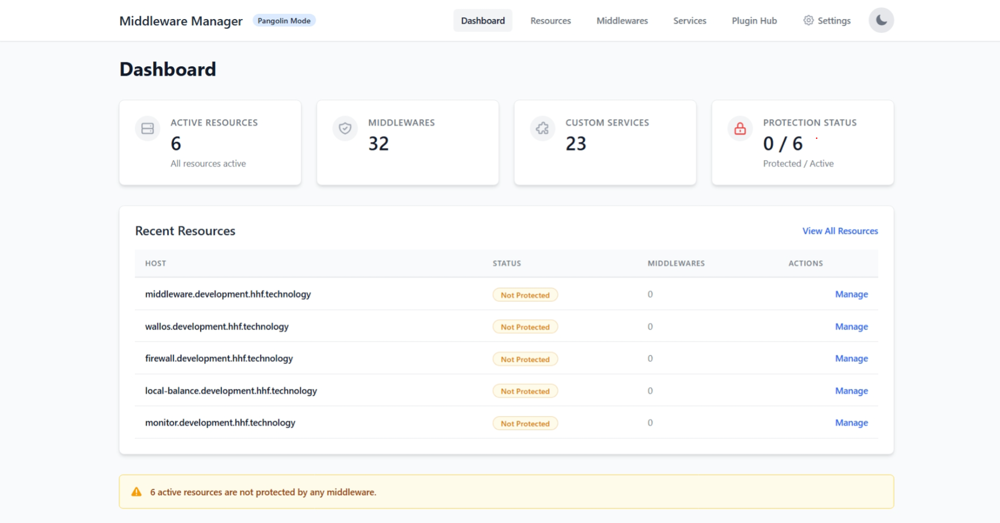
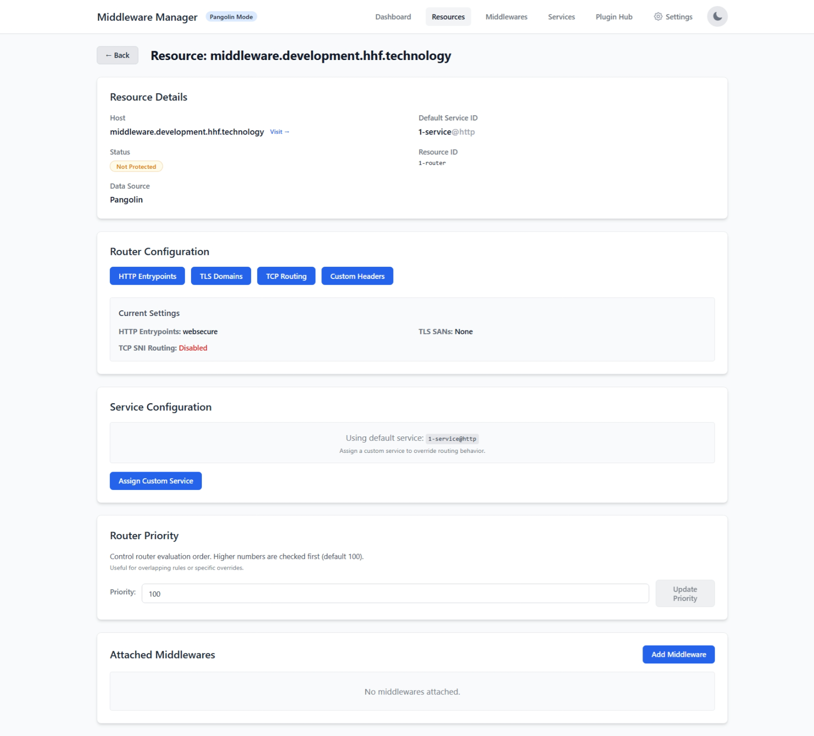  
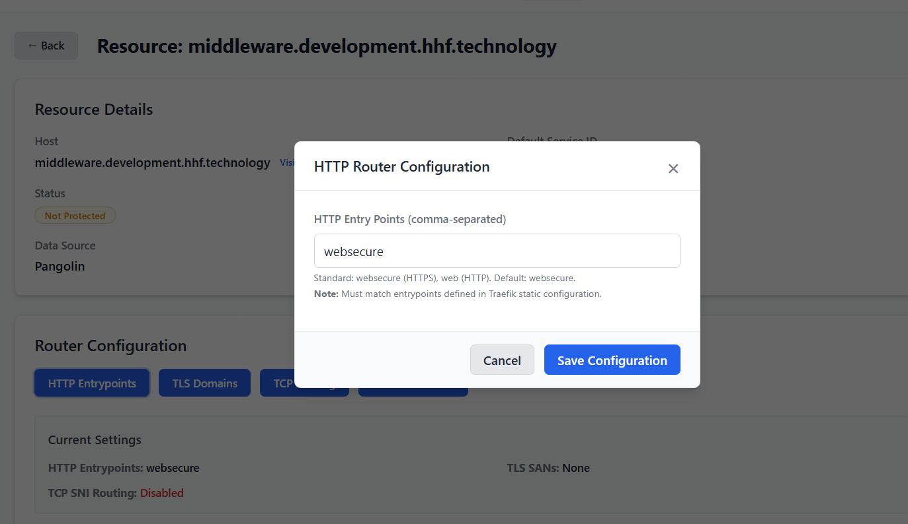
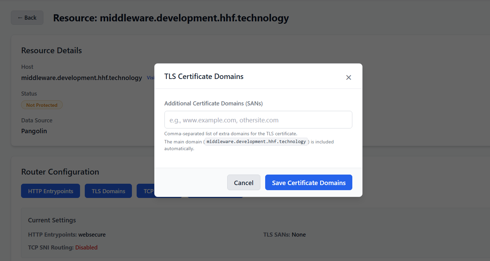
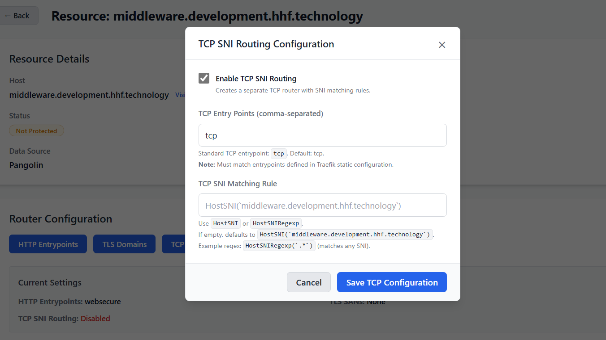
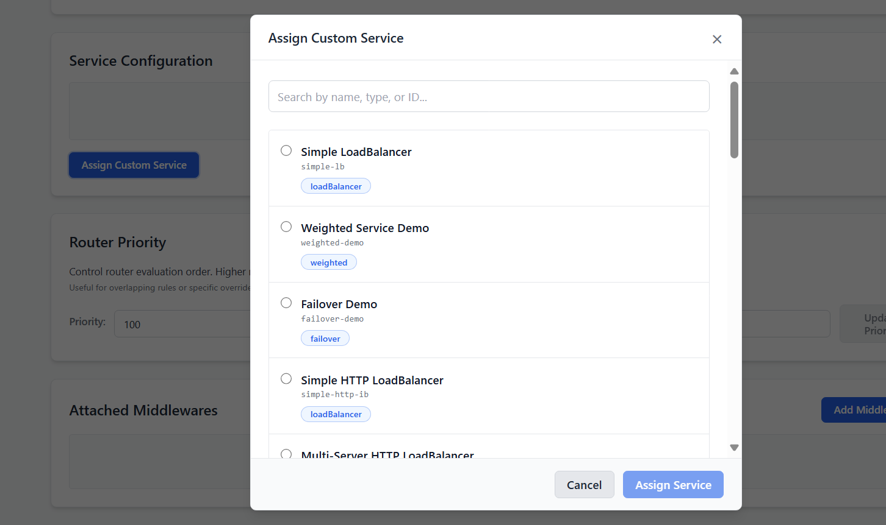
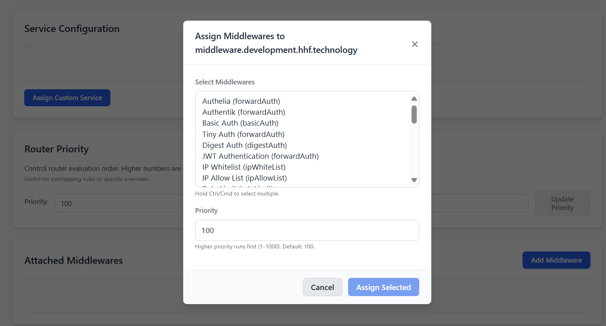
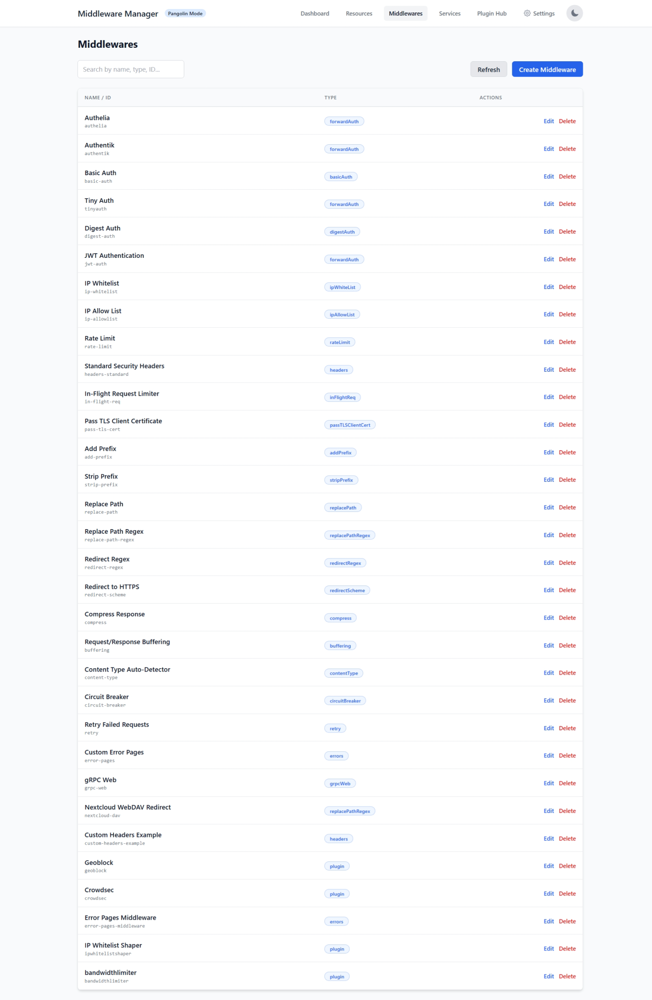
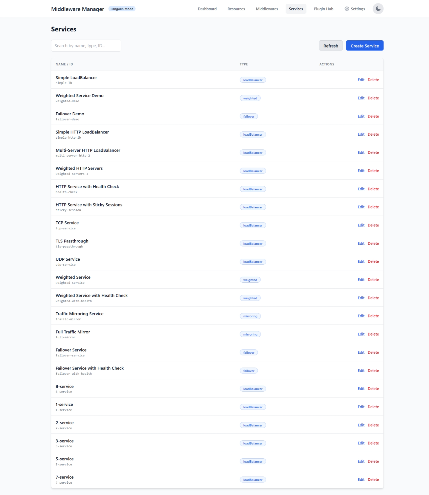
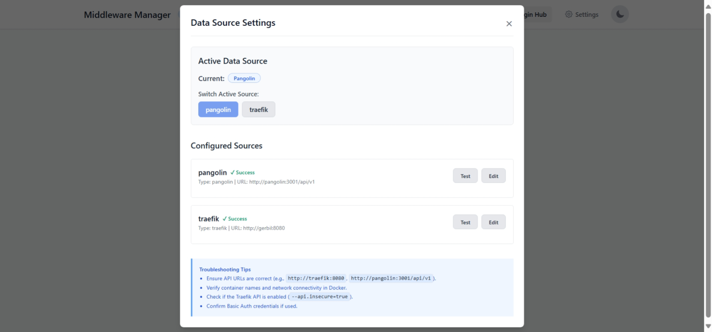
  </h5>
</div>

The Traefik Middleware Manager is a specialized microservice that empowers you to attach custom Traefik middlewares to your HTTP/TCP/UDP resources, manage router configurations, define custom Traefik services, and install Traefik plugins—all through a user-friendly web interface. It provides crucial functionality for implementing authentication, security headers, rate limiting, custom routing logic, and other middleware-based protections with ease.

## Overview

The Middleware Manager monitors resources from your chosen data source (either a Pangolin API or a direct Traefik API connection) and provides a web UI to:

* **Define and manage custom Traefik middlewares.**
* **Attach these middlewares to your resources** with specific priorities.
* **Configure advanced router settings** for each resource, including entrypoints, TLS Subject Alternative Names (SANs), TCP SNI routing rules, custom request headers, and router priority.
* **Create, update, and delete custom Traefik services** (LoadBalancer, Weighted, Mirroring, Failover).
* **Assign these custom services to your resources**, overriding default service behavior.
* **Discover, install, and manage Traefik plugins** directly from the UI.

When you make changes, the Middleware Manager generates the necessary Traefik dynamic configuration files (e.g., `resource-overrides.yml`), ensuring proper cross-provider references and seamless integration with your Traefik setup.

## Key Features

* **Dual Data Source Support**: Works with either a Pangolin API or a direct Traefik API.
* **Middleware Management**: Create, update, delete, and assign a wide array of Traefik middlewares.
* **Service Management**: Define and manage custom Traefik services (LoadBalancer, Weighted, Mirroring, Failover) and assign them to resources.
* **Advanced Router Configuration**:
    * Customize HTTP entrypoints.
    * Manage TLS SANs for certificates.
    * Configure TCP SNI routing rules and entrypoints.
    * Set custom request headers for backend services.
    * Adjust router priority for fine-grained control.
* **Plugin Hub**: Discover, install, and manage Traefik plugins.
* **Real-time Synchronization**: Keeps in sync with resources from your selected data source.
* **Web-Based UI**: Intuitive interface for all management tasks.
* **Template Libraries**: Pre-configured templates for common middlewares and services.
* **Cross-Provider Integration**: Correctly references Traefik resources across providers (e.g., `@file`, `@docker`, `@http`).
* **Database Persistence**: Stores all configurations in an SQLite database.
* **Wide Middleware Support**: Includes ForwardAuth, BasicAuth, Headers, RateLimit, IP Whitelisting, Path Manipulation, and more.
* **Dark Mode**: For comfortable viewing in low-light environments.

## Prerequisites

* Docker and Docker Compose
* Traefik v2.x or v3.x (can be part of a Pangolin stack or standalone)
* Network connectivity between the Middleware Manager container and your API endpoints (Pangolin or Traefik).

## Quick Start & Deployment Examples

### 1. Full Stack with Pangolin, Gerbil, and Traefik (Recommended for Pangolin Users)

This example demonstrates integrating Middleware Manager into a typical Pangolin setup.

```yaml
networks:
  pangolin_network: # Define your network
    driver: bridge
    name: pangolin # Or your preferred network name

services:
  pangolin:
    image: fosrl/pangolin:1.3.0 # Use your desired Pangolin version
    container_name: pangolin
    restart: unless-stopped
    volumes:
      - ./pangolin_config:/app/config # Map your Pangolin config directory
    healthcheck:
      test: ["CMD", "curl", "-f", "http://localhost:3001/api/v1/"]
      interval: "3s"
      timeout: "3s"
      retries: 5
    networks:
      - pangolin_network

  gerbil: # Gerbil VPN and reverse proxy (often includes Traefik)
    image: fosrl/gerbil:1.0.0 # Use your desired Gerbil version
    container_name: gerbil
    restart: unless-stopped
    depends_on:
      pangolin:
        condition: service_healthy
    command:
      - --reachableAt=http://gerbil_container_name_or_ip:3003
      - --generateAndSaveKeyTo=/var/config/gerbil_key
      - --remoteConfig=http://pangolin:3001/api/v1/gerbil/get-config
      - --reportBandwidthTo=http://pangolin:3001/api/v1/gerbil/receive-bandwidth
    volumes:
      - ./gerbil_config:/var/config # Map your Gerbil config directory
    cap_add:
      - NET_ADMIN
      - SYS_MODULE
    # Gerbil often exposes Traefik's ports if network_mode: service:gerbil is used for Traefik
    ports:
      - "51820:51820/udp" # Gerbil VPN port
      # Traefik ports might be exposed here or directly by Traefik service depending on setup
      - "80:80"
      - "443:443"
      - "8080:8080" # Traefik API/Dashboard if exposed through Gerbil
    networks:
      - pangolin_network

  traefik:
    image: traefik:v3.3.3
    container_name: traefik
    restart: unless-stopped

    network_mode: service:gerbil # Ports appear on the gerbil service

    depends_on:
      pangolin:
        condition: service_healthy
    command:
      - --configFile=/etc/traefik/traefik_config.yml
    volumes:
      - ./config/traefik:/etc/traefik:ro # Volume to store the Traefik configuration
      - ./config/letsencrypt:/letsencrypt # Volume to store the Let's Encrypt certificates
      - ./config/traefik/logs:/var/log/traefik # Volume to store Traefik logs
      - ./traefik/plugins-storage:/plugins-storage:rw
      - ./traefik/plugins-storage:/plugins-local:rw
      - ./config/traefik/rules:/rules
      - ./public_html:/var/www/html:ro 

  middleware-manager:
    image: hhftechnology/middleware-manager:v3.0.0 # Use the specific branch tag
    container_name: middleware-manager
    restart: unless-stopped
    depends_on: # Optional, but good practice
      - pangolin
      - traefik 
    volumes:
      - ./mm_data:/data                             # For the SQLite database
      - ./traefik_rules:/conf                     # MUST MATCH Traefik's rule directory
      - ./mm_config/templates.yaml:/app/config/templates.yaml # Optional custom middleware templates
      - ./mm_config/templates_services.yaml:/app/config/templates_services.yaml # Optional custom service templates
      - ./mm_config/config.json:/app/config/config.json       # For data source settings
      # Mount Traefik's static config directory for plugin management
      - ./traefik_static_config:/etc/traefik 
    environment:
      - PANGOLIN_API_URL=http://pangolin:3001/api/v1 # If ACTIVE_DATA_SOURCE is pangolin
      - TRAEFIK_API_URL=http://traefik:8080 # Or http://gerbil:8080 if Traefik API is via Gerbil
      - TRAEFIK_CONF_DIR=/conf
      - DB_PATH=/data/middleware.db
      - PORT=3456
      - ACTIVE_DATA_SOURCE=pangolin # Set to 'pangolin' or 'traefik'
      # Path to Traefik's main static config file *inside this container* (due to volume mount)
      - TRAEFIK_STATIC_CONFIG_PATH=/etc/traefik/traefik.yml
      - PLUGINS_JSON_URL=https://raw.githubusercontent.com/hhftechnology/middleware-manager/traefik-int/plugin/plugins.json
      # - DEBUG=true # Optional for development
    ports:
      - "3456:3456"
    networks:
      - pangolin_network
      
  # Optional: Other services like error-pages, traefik-relay, redis
  # Ensure they are on the same pangolin_network
````

**Create necessary directories on your host before starting:**
`mkdir -p ./pangolin_config ./gerbil_config ./traefik_static_config ./letsencrypt ./traefik_rules ./traefik_plugins ./mm_data ./mm_config`
And place your `traefik.yml` in `./traefik_static_config/`.

### 2\. Standalone Traefik (Without Pangolin)

This setup connects Middleware Manager directly to Traefik.

```yaml
networks:
  traefik_network:
    name: traefik_proxy
    driver: bridge

services:
  traefik:
    image: traefik:v3.0
    container_name: traefik
    restart: unless-stopped
    command:
      - "--api.insecure=true"
      - "--api.dashboard=true"
      - "--providers.docker=true"
      - "--providers.docker.exposedbydefault=false"
      - "--entrypoints.web.address=:80"
      - "--entrypoints.websecure.address=:443"
      - "--providers.file.directory=/rules" # For Middleware Manager rules
      - "--providers.file.watch=true"
      # Static config for plugins etc.
      - "--configFile=/etc/traefik/traefik.yml" 
      # - "--log.level=DEBUG" # For troubleshooting
    ports:
      - "80:80"
      - "443:443"
      - "8080:8080" # Traefik API/Dashboard
    volumes:
      - /var/run/docker.sock:/var/run/docker.sock:ro
      - ./traefik_config/static:/etc/traefik          # For traefik.yml
      - ./traefik_config/rules:/rules                 # For Middleware Manager's generated rules
      - ./traefik_config/letsencrypt:/letsencrypt
      - ./traefik_config/plugins:/plugins-storage     # For Traefik v2 plugins
    networks:
      - traefik_network

  middleware-manager:
    image: hhftechnology/middleware-manager:traefik-int
    container_name: middleware-manager
    restart: unless-stopped
    depends_on:
      - traefik
    volumes:
      - ./middleware_manager_data:/data
      - ./traefik_config/rules:/conf # MUST MATCH Traefik's rule directory
      - ./middleware_manager_config/templates.yaml:/app/config/templates.yaml
      - ./middleware_manager_config/templates_services.yaml:/app/config/templates_services.yaml
      - ./middleware_manager_config/config.json:/app/config/config.json
      # Mount Traefik's static config dir for plugin management
      - ./traefik_config/static:/etc/traefik 
    environment:
      - TRAEFIK_API_URL=http://traefik:8080
      - TRAEFIK_CONF_DIR=/conf
      - DB_PATH=/data/middleware.db
      - PORT=3456
      - ACTIVE_DATA_SOURCE=traefik # IMPORTANT for standalone mode
      - TRAEFIK_STATIC_CONFIG_PATH=/etc/traefik/traefik.yml # Path inside MM container
      - PLUGINS_JSON_URL=https://raw.githubusercontent.com/hhftechnology/middleware-manager/traefik-int/plugin/plugins.json
    ports:
      - "3456:3456"
    networks:
      - traefik_network

  # Example service managed by Traefik
  whoami:
    image: traefik/whoami
    container_name: whoami
    labels:
      - "traefik.enable=true"
      - "traefik.http.routers.whoami.rule=Host(`whoami.localhost`)" # Replace with your host
      - "traefik.http.routers.whoami.entrypoints=websecure"
      - "traefik.http.routers.whoami.tls.certresolver=myresolver" # Configure your cert resolver
    networks:
      - traefik_network
```

**Create necessary directories on your host:**
`mkdir -p ./traefik_config/static ./traefik_config/rules ./traefik_config/letsencrypt ./traefik_config/plugins ./middleware_manager_data ./middleware_manager_config`
Place your `traefik.yml` in `./traefik_config/static/`.

After configuring, start services: `docker-compose up -d`.
Access the UI at `http://your-server-ip:3456`.

### Environment Variables for Middleware Manager

| Variable                      | Description                                                                 | Default                                                                                      |
| ----------------------------- | --------------------------------------------------------------------------- | -------------------------------------------------------------------------------------------- |
| `PANGOLIN_API_URL`            | URL to your Pangolin API (if `ACTIVE_DATA_SOURCE` is `pangolin`)            | `http://pangolin:3001/api/v1`                                                                  |
| `TRAEFIK_API_URL`             | URL to your Traefik API                                                     | `http://host.docker.internal:8080` (tries auto-discovery if empty)                           |
| `TRAEFIK_CONF_DIR`            | Directory inside Middleware Manager to write Traefik dynamic configs        | `/conf`                                                                                      |
| `DB_PATH`                     | Path to SQLite database inside the container                                | `/data/middleware.db`                                                                        |
| `PORT`                        | Port for Middleware Manager web UI and API                                    | `3456`                                                                                       |
| `CONFIG_DIR`                  | Directory for Middleware Manager's internal config files (templates, etc.)    | `/app/config`                                                                                |
| `ACTIVE_DATA_SOURCE`          | Initial data source: `pangolin` or `traefik`                                | `pangolin`                                                                                   |
| `TRAEFIK_STATIC_CONFIG_PATH`  | Path to Traefik's main static config file (e.g., `traefik.yml`) **inside this container** | `/etc/traefik/traefik.yml`                                                                   |
| `PLUGINS_JSON_URL`            | URL to fetch the list of available Traefik plugins                          | `https://raw.githubusercontent.com/hhftechnology/middleware-manager/traefik-int/plugin/plugins.json` |
| `CHECK_INTERVAL_SECONDS`      | How often to check for new resources (seconds)                              | `30`                                                                                         |
| `SERVICE_INTERVAL_SECONDS`    | How often to check for new services (seconds)                             | `30`                                                                                         |
| `GENERATE_INTERVAL_SECONDS`   | How often to update Traefik dynamic configuration files (seconds)           | `10`                                                                                         |
| `DEBUG`                       | Enable debug logging                                                        | `false`                                                                                      |
| `ALLOW_CORS`                  | Enable CORS for API                                                         | `false`                                                                                      |
| `CORS_ORIGIN`                 | Allowed CORS origin (if `ALLOW_CORS` is true; empty means allow all)        | `""`                                                                                         |

### Data Source Configuration (`config.json`)

The Middleware Manager can connect to either Pangolin or Traefik as a data source for discovering resources. Settings are managed via `/app/config/config.json` (volume mount this path).

Example `config.json`:

```json
{
  "active_data_source": "traefik",
  "data_sources": {
    "pangolin": {
      "type": "pangolin",
      "url": "http://pangolin:3001/api/v1",
      "basic_auth": {
        "username": "",
        "password": ""
      }
    },
    "traefik": {
      "type": "traefik",
      "url": "http://traefik_container_name:8080",
      "basic_auth": {
        "username": "",
        "password": ""
      }
    }
  }
}
```

Switch `active_data_source` and update URLs/credentials via the **Settings** panel in the UI.

### Custom Templates

  * **Middleware Templates**: Create `templates.yaml` in your mapped `CONFIG_DIR` (e.g., `./middleware_manager_config/templates.yaml`).
  * **Service Templates**: Create `templates_services.yaml` in your mapped `CONFIG_DIR` (e.g., `./middleware_manager_config/templates_services.yaml`).

(Refer to previous README for example template structures).

## Usage Guide

(This section remains largely the same as the previous README, covering Dashboard, Managing Resources, Middlewares, Services, and Plugins. Key updates are integrated below.)

### Managing Resources

  * **Advanced Router Configuration**:
      * **Custom Headers**: Useful for setting the `Host` header correctly if Traefik terminates TLS but your backend expects the original host, or for passing other specific headers.
  * **Assigning a Custom Service**: When you assign a custom service, the resource's router will use your defined Traefik service (e.g., a load balancer with specific health checks) instead of the default one (e.g., the Docker container itself).

### Managing Services

  * **Protocol (for LoadBalancer)**:
      * **HTTP**: For standard web services. Servers are defined with `"url": "http://backend:port"`.
      * **TCP**: For raw TCP traffic. Servers are defined with `"address": "backend_ip_or_host:port"`.
      * **UDP**: For UDP-based services. Servers are defined with `"address": "backend_ip_or_host:port"`.
  * **Service Naming**: When referencing services within other service definitions (e.g., in `weighted` or `failover` types), ensure you use the correct name and provider, typically `service-id@file` for services created in Middleware Manager.

### Managing Plugins (Plugin Hub)

  * **TRAEFIK\_STATIC\_CONFIG\_PATH**: This environment variable (or UI setting) tells Middleware Manager where to find Traefik's main `traefik.yml` (or `.toml`) file. **This path must be accessible from within the Middleware Manager container** (via a volume mount). For example, if your host's Traefik config is at `./traefik_config/static/traefik.yml` and you mount `./traefik_config/static` to `/etc/traefik` in the Middleware Manager container, then `TRAEFIK_STATIC_CONFIG_PATH` should be `/etc/traefik/traefik.yml`.
  * **Plugin Installation**: Adds a declaration to your Traefik static config.
    ```yaml
    # In your traefik.yml (managed by Middleware Manager's Plugin Hub)
    experimental:
      plugins:
        myplugin: # Key derived from moduleName
          moduleName: https://github.com/vendor/my-traefik-plugin
          version: v1.0.0
    ```
  * **Restart Traefik**: **Crucial step\!** After installing/removing plugins via Middleware Manager, Traefik must be restarted to load/unload the plugin code.
  * **Using Plugins**: Create a middleware of type `plugin`. The JSON config key must match the plugin's key in `traefik.yml`.
    ```json
    // Middleware config in Middleware Manager UI for 'myplugin'
    {
      "myplugin": {
        "optionA": "value1",
        "anotherOption": true
      }
    }
    ```

## Troubleshooting

(Similar to previous README, with emphasis on checking container names and network for API connectivity, and ensuring `TRAEFIK_STATIC_CONFIG_PATH` is correctly set for plugin management.)

  * **Plugin Issues**:
      * Verify `TRAEFIK_STATIC_CONFIG_PATH` in Middleware Manager points to the *correct path inside its own container* where Traefik's static config is mounted.
      * Ensure Traefik was restarted after plugin installation/removal.
      * Check Traefik logs for plugin loading errors.
      * The plugin `moduleName` and `version` in the static config must be exact.

## Development

(Same as previous README)

### Prerequisites

  * Go (version as per `go.mod`)
  * Node.js (version as per `ui/package.json` engines, or latest LTS)
  * npm or yarn

### Backend

```bash
# Navigate to the project root
go run main.go 
# For build:
# go build -o middleware-manager main.go
```

### Frontend

```bash
cd ui
# If node_modules is missing: npm install (or yarn install)
npm start # or yarn start
```

## License

MIT License

## Contributing

Contributions, issues, and feature requests are welcome\! Please feel free to submit a Pull Request or open an issue on the GitHub repository.
