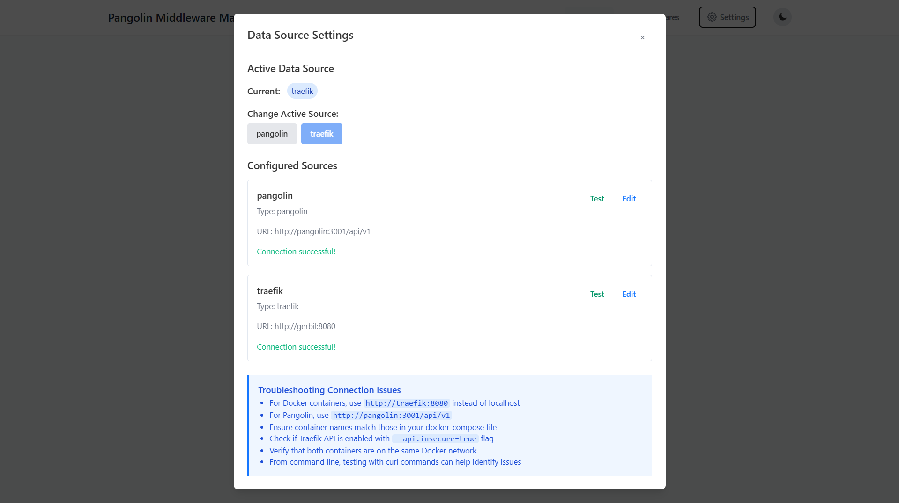
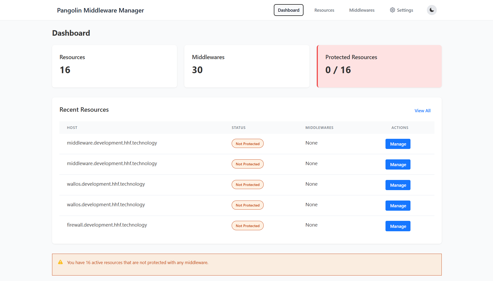
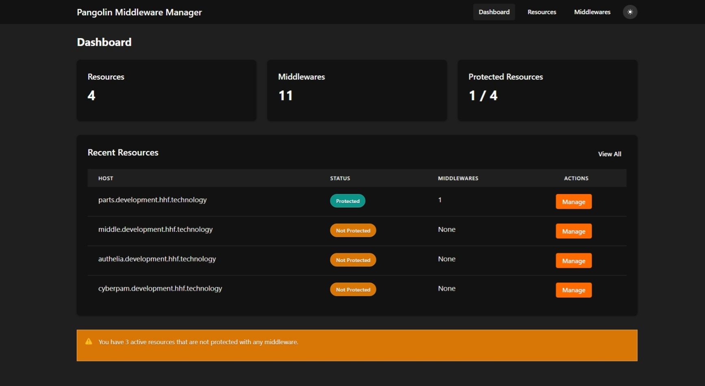
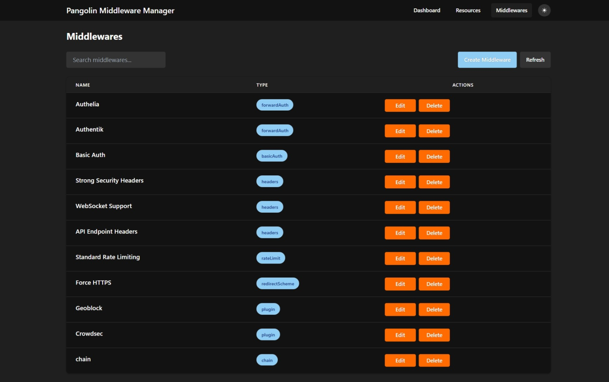
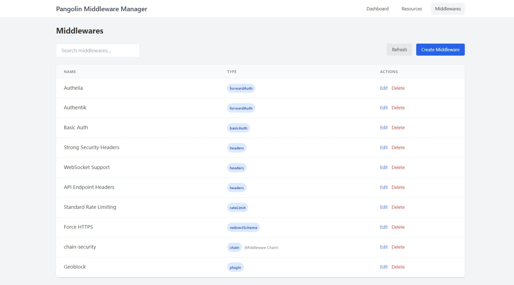
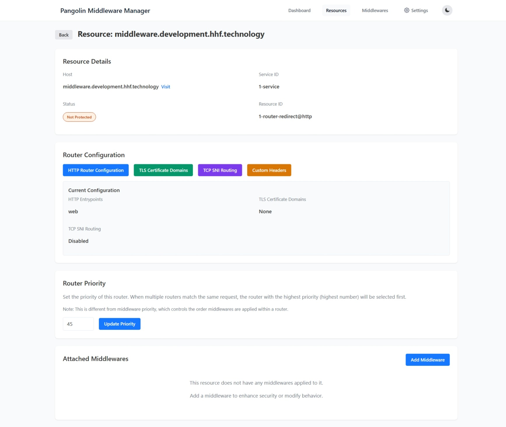
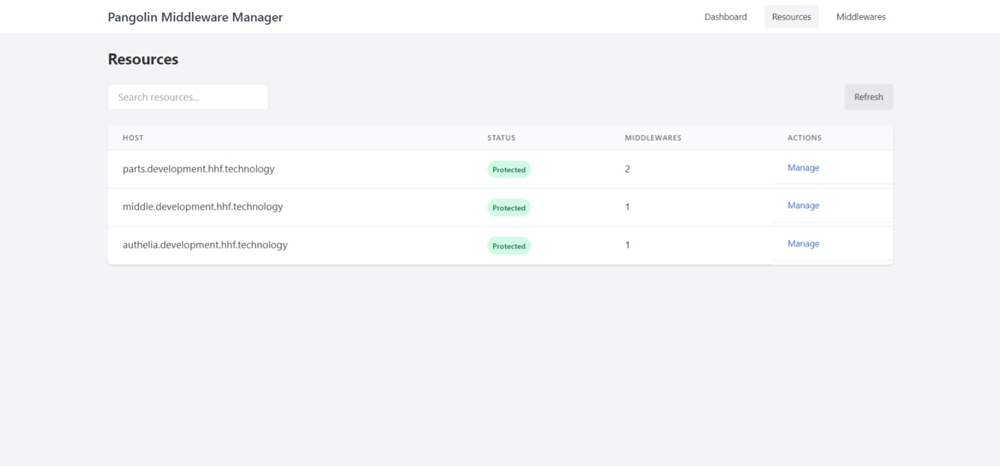

<div align="center">
    <h1 align="center"><a href="https://forum.hhf.technology/t/enhancing-your-pangolin-deployment-with-middleware-manager">Pangolin Middleware Manager</a></h1>

</div>

<h3 align="center">Middleware/Router Manager for your Pangolin Stack</h3>
<div align="center">


</div>

<div align="center">
  <h5>

  





  </h5>
</div>


A specialized microservice that enables custom Traefik middleware attachment to resources. It provides crucial functionality for implementing authentication, security headers, rate limiting, and other middleware-based protections with a simple web interface.

## Overview

The Middleware Manager monitors HTTP/TCP resources and provides a user-friendly web interface to attach Traefik middlewares. It now supports two operational modes:

1. **Pangolin Integration Mode**: Monitors resources created in Pangolin (default)
2. **Standalone Traefik Mode**: Connects directly to Traefik API without requiring Pangolin

When you add a middleware to a resource, it creates Traefik configuration files with proper cross-provider references, ensuring your entire middleware chain works correctly.

## Key Features

- **Dual Data Source Support**: Works with either Pangolin API or direct Traefik API
- **Real-time synchronization** with resources from your selected data source
- **Web-based management UI** for easy configuration
- **Template library** with 30+ pre-configured middlewares
- **Cross-provider integration** that properly references Traefik resources
- **Database persistence** for configuration storage
- **Wide middleware support** including ForwardAuth, BasicAuth, Headers, RateLimit, and more
- **Plugin compatibility** with Traefik v2/v3 plugins like CrowdSec, GeoBlock, and CloudflareWarp
- **TCP SNI Routing** support for TCP-based services
- **TLS Certificate Management** for configuring additional SAN domains
- **Dark mode support** for the user interface

## Prerequisites

- Docker and Docker Compose
- Traefik v2.x or v3.x (either as part of Pangolin or standalone)
- Network connectivity between the Middleware Manager and your API endpoints

## Quick Start

### Using with Pangolin (Default Mode)

Add the Middleware Manager to your existing Pangolin `docker-compose.yml`:

```yaml
middleware-manager:
  image: hhftechnology/middleware-manager:latest
  container_name: middleware-manager
  restart: unless-stopped
  volumes:
    - ./data:/data
    - ./config/traefik/rules:/conf
    - ./config/middleware-manager/templates.yaml:/app/config/templates.yaml  # Optional for custom templates
  environment:
    - PANGOLIN_API_URL=http://pangolin:3001/api/v1
    - TRAEFIK_CONF_DIR=/conf
    - DB_PATH=/data/middleware.db
    - PORT=3456
  ports:
    - "3456:3456"
```

### Using with Standalone Traefik (Without Pangolin)

Create a `config.json` file with Traefik API as the active data source:

```json
{
  "active_data_source": "traefik",
  "data_sources": {
    "traefik": {
      "type": "traefik",
      "url": "http://traefik:8080",
      "basic_auth": {
        "username": "",
        "password": ""
      }
    }
  }
}
```

Then add the Middleware Manager to your `docker-compose.yml`:

```yaml
middleware-manager:
  image: hhftechnology/middleware-manager:latest
  container_name: middleware-manager
  restart: unless-stopped
  volumes:
    - ./data:/data
    - ./config/traefik/rules:/conf
    - ./config/middleware-manager/config.json:/app/config/config.json
  environment:
    - TRAEFIK_API_URL=http://traefik:8080
    - TRAEFIK_CONF_DIR=/conf
    - DB_PATH=/data/middleware.db
    - PORT=3456
    - ACTIVE_DATA_SOURCE=traefik
  ports:
    - "3456:3456"
```

Start the service:

```bash
docker-compose up -d middleware-manager
```

Access the UI:
```
http://your-server:3456
```

## Configuration

### Environment Variables

| Variable | Description | Default |
|----------|-------------|---------|
| `PANGOLIN_API_URL` | URL to your Pangolin API | `http://pangolin:3001/api/v1` |
| `TRAEFIK_API_URL` | URL to your Traefik API | `http://host.docker.internal:8080` |
| `TRAEFIK_CONF_DIR` | Directory to write Traefik configurations | `/conf` |
| `DB_PATH` | Path to SQLite database | `/data/middleware.db` |
| `PORT` | Port for web UI and API | `3456` |
| `CONFIG_DIR` | Directory for config files | `/app/config` |
| `CHECK_INTERVAL_SECONDS` | How often to check for new resources (seconds) | `30` |
| `GENERATE_INTERVAL_SECONDS` | How often to update configuration files (seconds) | `10` |
| `DEBUG` | Enable debug logging | `false` |
| `ALLOW_CORS` | Enable CORS for API | `false` |
| `CORS_ORIGIN` | Allowed CORS origin | `""` (all) |
| `ACTIVE_DATA_SOURCE` | Initial data source to use | `pangolin` |

### Data Source Configuration

The Middleware Manager can connect to either Pangolin or Traefik as a data source for resources. You can configure this in two ways:

1. **Environment Variables**: Set `ACTIVE_DATA_SOURCE=traefik` to use Traefik by default
2. **config.json**: Create a configuration file at `/app/config/config.json` with your data source settings

Example `config.json`:

```json
{
  "active_data_source": "traefik",
  "data_sources": {
    "pangolin": {
      "type": "pangolin",
      "url": "http://pangolin:3001/api/v1",
      "basic_auth": {
        "username": "",
        "password": ""
      }
    },
    "traefik": {
      "type": "traefik",
      "url": "http://traefik:8080",
      "basic_auth": {
        "username": "",
        "password": ""
      }
    }
  }
}
```

You can switch between data sources at any time through the UI by clicking the "Settings" button in the navigation bar.

### Custom Middleware Templates

Create a file at `./config/middleware-manager/templates.yaml` with custom middleware templates:

```yaml
middlewares:
  - id: "security-headers"
    name: "Strong Security Headers"
    type: "headers"
    config:
      customResponseHeaders:
        Server: ""
        X-Powered-By: ""
      browserXSSFilter: true
      contentTypeNosniff: true
      customFrameOptionsValue: "SAMEORIGIN"
      forceSTSHeader: true
      stsIncludeSubdomains: true
      stsSeconds: 63072000
      
  - id: "rate-limit"
    name: "Standard Rate Limiting"
    type: "rateLimit"
    config:
      average: 100
      burst: 50
```

## Using with Standalone Traefik

To use the Middleware Manager with a standalone Traefik instance (without Pangolin):

1. **Enable Traefik API**: Ensure your Traefik instance has the API enabled with the following flags:
   ```
   --api.insecure=true
   --api.dashboard=true
   ```

2. **Configure Data Source**: Set the active data source to "traefik" by either:
   - Setting the environment variable: `ACTIVE_DATA_SOURCE=traefik`
   - Creating a config.json file with Traefik as the active source

3. **Set Traefik API URL**: Configure the URL to your Traefik API:
   - In docker-compose: `TRAEFIK_API_URL=http://traefik:8080`
   - In config.json: Use the "url" field in the traefik data source

4. **Volume Mapping**: Ensure the rules directory is mounted to the same location in both the Middleware Manager and Traefik:
   ```yaml
   middleware-manager:
     volumes:
       - ./config/traefik/rules:/conf
   
   traefik:
     volumes:
       - ./config/traefik/rules:/rules
   ```

5. **Configure Traefik File Provider**: Add a file provider to your Traefik configuration:
   ```yaml
   providers:
     file:
       directory: /rules
       watch: true
   ```

With this configuration, the Middleware Manager will directly connect to Traefik's API, discover all routers, and allow you to attach middlewares to them through the web UI.

## Usage Guide

### Adding Middleware to a Resource

1. Navigate to the "Resources" tab in the UI
2. Click "Manage" next to the resource you want to protect
3. Click "Add Middleware"
4. Select a middleware from the dropdown (or create a new one)
5. Set the priority value if needed (higher numbers have lower precedence)
6. Click "Add Middleware"
7. The middleware will be automatically applied to the resource

### Creating Custom Middleware

1. Navigate to the "Middlewares" tab in the UI
2. Click "Create Middleware"
3. Enter a name for your middleware
4. Select the middleware type (ForwardAuth, BasicAuth, Headers, etc.)
5. Configure the middleware settings using the JSON editor
6. Click "Create Middleware"
7. The new middleware will be available to assign to resources

### Advanced Router Configuration

For each resource, you can configure:

1. **HTTP Router Configuration**: Set custom entry points (e.g., websecure, web)
2. **TLS Certificate Domains**: Add Subject Alternative Names (SANs) to the TLS certificate
3. **TCP SNI Routing**: Enable TCP routing with custom SNI rules and entry points
4. **Custom Headers**: Add custom headers to requests sent to backend services
5. **Router Priority**: Control which router takes precedence when multiple routers match

## Traefik Plugin Integration

To use Traefik plugins like CrowdSec, GeoBlock, or CloudflareWarp:

1. Add the plugin to your Traefik static configuration:
   ```yaml
   # In traefik_config.yml
   experimental:
     plugins:
       crowdsec:
         moduleName: github.com/maxlerebourg/crowdsec-bouncer-traefik-plugin
         version: v1.4.2
       geoblock:
         moduleName: github.com/PascalMinder/geoblock
         version: v0.3.2
   ```

2. Choose the "plugin" middleware type when creating a new middleware in the UI
3. Configure the plugin according to its documentation

## Troubleshooting

### Connection Issues

If you have trouble connecting to your data source:

1. For Docker containers, use container names instead of localhost:
   - Pangolin API: `http://pangolin:3001/api/v1`
   - Traefik API: `http://traefik:8080`

2. Ensure container names match those in your docker-compose file

3. Verify that Traefik API is enabled with proper flags:
   - `--api.insecure=true`
   - `--api.dashboard=true`

4. Check if containers are on the same Docker network

5. Test connections with curl commands:
   ```bash
   # Test Pangolin connection
   curl http://pangolin:3001/api/v1/traefik-config
   
   # Test Traefik connection
   curl http://traefik:8080/api/http/routers
   ```

### "The service does not exist" error in Traefik logs

This usually means the cross-provider reference isn't working correctly:

1. Check that service references include the `@http` suffix
2. Verify that the configuration file was generated correctly in your `/conf` directory
3. Restart the Middleware Manager

### "The middleware does not exist" error in Traefik logs

1. Check if the middleware is properly defined
2. Ensure provider suffixes are correct (`@http` for Pangolin middlewares, `@file` for file-defined)
3. Check if required Traefik plugins are installed

## Full Docker Compose Example

Here's a complete example using both Pangolin and Traefik with the Middleware Manager:

```yaml
version: '3.8'

services:
  pangolin:
    image: fosrl/pangolin:1.2.0
    container_name: pangolin
    restart: unless-stopped
    volumes:
      - ./config:/app/config
    healthcheck:
      test: ["CMD", "curl", "-f", "http://localhost:3001/api/v1/"]
      interval: "3s"
      timeout: "3s"
      retries: 5

  traefik:
    image: traefik:v3.3.3
    container_name: traefik
    restart: unless-stopped
    ports:
      - "80:80"
      - "443:443"
      - "8080:8080"
    depends_on:
      pangolin:
        condition: service_healthy
    command:
      - --api.insecure=true
      - --api.dashboard=true
      - --providers.file.directory=/rules
      - --providers.file.watch=true
      - --entrypoints.web.address=:80
      - --entrypoints.websecure.address=:443
    volumes:
      - ./config/traefik:/etc/traefik
      - ./config/letsencrypt:/letsencrypt
      - ./config/traefik/rules:/rules

  middleware-manager:
    image: hhftechnology/middleware-manager:latest
    container_name: middleware-manager
    restart: unless-stopped
    volumes:
      - ./data:/data
      - ./config/traefik/rules:/conf
      - ./config/middleware-manager/templates.yaml:/app/config/templates.yaml
      - ./config/middleware-manager/config.json:/app/config/config.json
    environment:
      - PANGOLIN_API_URL=http://pangolin:3001/api/v1
      - TRAEFIK_API_URL=http://traefik:8080
      - TRAEFIK_CONF_DIR=/conf
      - DB_PATH=/data/middleware.db
      - PORT=3456
    ports:
      - "3456:3456"

networks:
  default:
    driver: bridge
    name: pangolin
```

## Standalone Traefik Example (Without Pangolin)

Here's an example using only Traefik without Pangolin:

```yaml
version: '3.8'

services:
  traefik:
    image: traefik:v3.3.3
    container_name: traefik
    restart: unless-stopped
    ports:
      - "80:80"
      - "443:443"
      - "8080:8080"
    command:
      - --api.insecure=true
      - --api.dashboard=true
      - --providers.docker=true
      - --providers.file.directory=/rules
      - --providers.file.watch=true
      - --entrypoints.web.address=:80
      - --entrypoints.websecure.address=:443
    volumes:
      - /var/run/docker.sock:/var/run/docker.sock:ro
      - ./config/traefik:/etc/traefik
      - ./config/letsencrypt:/letsencrypt
      - ./config/traefik/rules:/rules

  middleware-manager:
    image: hhftechnology/middleware-manager:latest
    container_name: middleware-manager
    restart: unless-stopped
    volumes:
      - ./data:/data
      - ./config/traefik/rules:/conf
      - ./config/middleware-manager/config.json:/app/config/config.json
    environment:
      - TRAEFIK_API_URL=http://traefik:8080
      - TRAEFIK_CONF_DIR=/conf
      - DB_PATH=/data/middleware.db
      - PORT=3456
      - ACTIVE_DATA_SOURCE=traefik
    ports:
      - "3456:3456"

  # Example services to manage with middlewares
  whoami:
    image: traefik/whoami
    labels:
      - "traefik.enable=true"
      - "traefik.http.routers.whoami.rule=Host(`whoami.example.com`)"
      - "traefik.http.routers.whoami.entrypoints=websecure"
      - "traefik.http.routers.whoami.tls=true"
```

## Troubleshooting

### "The service does not exist" error in Traefik logs

This usually means the cross-provider reference isn't working correctly. The Middleware Manager should automatically use `@http` suffix for Pangolin services, but if you see this error:

1. Check if the middleware configuration file was generated correctly in your `/conf` directory
2. Verify that service references include the `@http` suffix
3. Restart the Middleware Manager

### "The middleware does not exist" error in Traefik logs

Similar to the service error, but for middlewares:

1. Check if the middleware is properly defined
2. Ensure Pangolin-defined middlewares have an `@http` suffix when referenced
3. Check if the middleware requires a Traefik plugin that isn't installed

### Middleware not being applied

1. Check Traefik's dashboard for routing information
2. Verify the middleware is correctly associated with the resource
3. Check the middleware priority (lower numbers have higher precedence)
4. Look for errors in the Traefik logs

## Development

### Prerequisites

- Go 1.19+
- Node.js 16+
- npm or yarn

### Backend Development

```bash
# Run backend in development mode
go run main.go

# Build backend
go build -o middleware-manager
```

### Frontend Development

```bash
cd ui
npm install
npm start
```

## License

MIT License

## Contributing

Contributions are welcome! Please feel free to submit a Pull Request.
